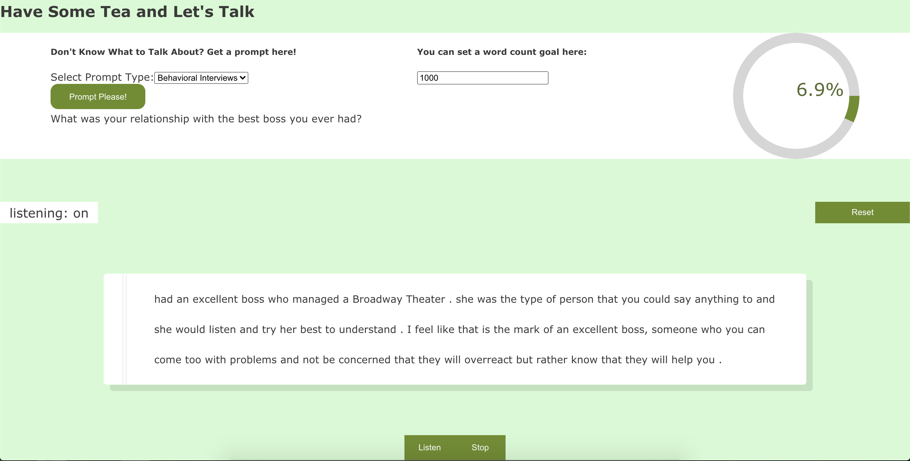

Do you want practice speaking? In our experience, public speaking can be difficult- especially if you suffer from social anxiety. If you want to improve, but are unsure of the first step, my reccomendation for you is to practice. I know that that is a concept easier said than done, but let us help you get started. Let'sTalk is a very simple app that will listen and print what you say to the screen. Let's talk and help you feel more confident in you words.

Let's practice.

This static version of Let'sTalk utlizes the logic and themes of the original app, minus the saving thoughts feature.

## Summary

Self-help app that encourages users to practice speaking. For those with social anxiety or trouble speaking in public.

### Example Image

[Visit Let'sTalk here!](https://lets-talk231.herokuapp.com/)

## Installation

### Step 1: GET THE REPO
  Fork this repo and clone it down to your local machine.
### Step 2: SPIN HER UP
  1. In the root directory's terminal run the command: npm start
  2. This should spin up the app to run on your localhost. Go to the browser and search the URL localhost:3000 and Let'sTalk should be waiting for you!

## Conclusion
  This app is a work-in-progress so please be patient with its flaws. Every day we work towards the ideal and LetsTalk is too!